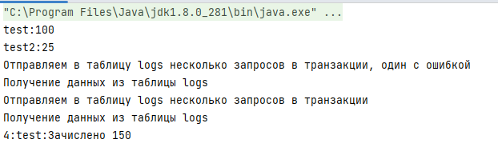

= Отчет по лабораторной работе 4
:listing-caption: Листинг
:source-highlighter: coderay

Студент: Рябков Владислав Алексеевич, Зернов Иван Владимирович

Группа: ПИМ-22

== 1. Постановка задачи

В процессе выполнения лабораторной работы необходимо выполнить следующие задачи:

. ClassLoader
    - Ознакомится с руководством по загрузке классов и ClassLoader
    - Продемонстрировать работу своего загрузчика классов
    - Определить разницу между своей и стандартной реализацией
. JDBC
    - Установить соединение с БД с помощью JDBC драйвера
    - Создать таблицу БД с помощью JDBC
    - Реализовать CRUD-методы для одной таблицы
    - Реализовать несколько запросов в БД, которые должны выполняться в рамках одной транзакции
. Exception
    - Обернуть методы для работы с БД в try/catch с откатом транзакций и закрытием соединения
    - Продемонстрировать в программе откат транзакции

== 2. Разработка задачи

=== 2.1 Структура проекта

Проект разделен на следующие директории:

/src:::
Директория исходным кодом лабораторной работы

/result:::
Отчет по проделанной работе

== 3. Информация о реализации

=== 3.1 Задание 1

Для выполнения первого задания созданы классы ClassTest - класс, который будет загружаться своим класслоадером. CustomClassClassLoader - реализация своего загрузчика. Main - главный класс программы, который использует загрузчик для загрузки класса.

.CustomClassLoader
[source,java]
----
import java.io.ByteArrayOutputStream;
import java.io.IOException;
import java.io.InputStream;

public class CustomClassLoader extends ClassLoader {
    @Override
    public Class<?> findClass(String name) {
        byte[] bt = loadClassData(name);
        return defineClass(name, bt, 0, bt.length);
    }

    private byte[] loadClassData(String className) {
        InputStream is = getClass().getClassLoader().getResourceAsStream(className.replace(".", "/") + ".class");
        ByteArrayOutputStream byteSt = new ByteArrayOutputStream();

        int len = 0;
        try {
            while ((len = is.read()) != -1) {
                byteSt.write(len);
            }
        } catch (IOException e) {
            e.printStackTrace();
        }
        return byteSt.toByteArray();
    }
}
----

.ClassTest

[source,java]
----
public class ClassTest {
    public void test() {
        System.out.println("Class loaded from custom class loader");
    }
}

----

.Main

[source,xml]
----
import java.lang.reflect.InvocationTargetException;
import java.lang.reflect.Method;

public class Main {
    public static void main(String[] args) throws InstantiationException, IllegalAccessException, NoSuchMethodException, InvocationTargetException {
        CustomClassLoader customClassLoader = new CustomClassLoader();
        Class<?> cl = customClassLoader.findClass("ClassTest");
        Object ob = cl.newInstance();
        Method method = cl.getMethod("test");
        method.invoke(ob);
    }
}
----

Отличием CustomClassLoader и стандартной реализацией является переопределенный метод findClass, а также то, что классы, загруженные через стандартные загрузчики Java не будут видеть этот класс.

=== 3.2 Задание 2 и 3

Для выполнения этого задания добавим в проект класс Main_jdbc и библиотеку JDBC.

Реализована установка соединения с базой данных с использованием JDBC драйвера. Создание таблицы data, вставка нескольких строк данныъ в эту таблицу. Функции вставки находятся внутри try блока, в случае ошибки соединение и statement закрываются. Выполняется обновление, получение и удаление данных с таблицей data, аналогично в  блоках try.

Реализована функция testTransaction c аргументом failure, что позволяет проверить ситуацию с откатом транзакции. 

.Main_jdbc
[source,java]
----
 import java.sql.*;

public class Main_jdbc {
    static Connection connection = null;
    static Statement stmt = null;

    public static void main(String[] args) {

        try {
            //Установка соединения с БД с помощью JDBC драйвера
            new com.mysql.jdbc.Driver();
            connection = DriverManager.getConnection("jdbc:mysql://185.192.111.12:3306/vladru?user=vladru&password=k38VsPpFJb0lQgQzdotc&characterEncoding=UTF-8");
        } catch (SQLException e) {
            throw new RuntimeException(e);
        }

        try {
            stmt = connection.createStatement();
        } catch (SQLException e) {
            //Закрытие соединения в случае ошибки
            closeConnection();
            throw new RuntimeException(e);
        }

        try {
            stmt.executeUpdate("CREATE TABLE IF NOT EXISTS data " +
                    "(name VARCHAR(255), " +
                    " cash INTEGER, " +
                    " PRIMARY KEY ( name ))");
        } catch (SQLException e) {
            //Закрытие соединения в случае ошибки
            closeConnection();
            throw new RuntimeException(e);
        }

        //Вставка данных
        try {
            stmt.executeUpdate("INSERT IGNORE INTO data VALUES ('test', 25)");
            stmt.executeUpdate("INSERT IGNORE INTO data VALUES ('test2', 25)");
        } catch (SQLException e) {
            //Закрытие соединения в случае ошибки
            closeConnection();
            throw new RuntimeException(e);
        }

        //Обновление данных
        try {
            stmt.executeUpdate("UPDATE data SET `cash` = 100 WHERE `name` = 'test'");
        } catch (SQLException e) {
            //Закрытие соединения в случае ошибки
            closeConnection();
            throw new RuntimeException(e);
        }

        //Получение данных
        try (ResultSet rs = stmt.executeQuery("SELECT * from `data`")) {
            while (rs.next()) {
                System.out.println(rs.getString(1) + ":" + rs.getInt(2));
            }
        } catch (SQLException e) {
            //Закрытие соединения в случае ошибки
            closeConnection();
            throw new RuntimeException(e);
        }

        //Удаление данных
        try {
            stmt.executeUpdate("DELETE FROM data WHERE `name` = 'test2'");
        } catch (SQLException e) {
            //Закрытие соединения в случае ошибки
            closeConnection();
            throw new RuntimeException(e);
        }

        System.out.println("Отправляем в таблицу logs несколько запросов в транзакции, один с ошибкой");
        testTransaction(true);
        getDataFromLogsTable();
        System.out.println("Отправляем в таблицу logs несколько запросов в транзакции");
        testTransaction(false);
        getDataFromLogsTable();

        closeConnection();
    }

    private static void getDataFromLogsTable() {
        System.out.println("Получение данных из таблицы logs");
        //Получение данных
        try (ResultSet rs = stmt.executeQuery("SELECT * from `logs`")) {
            while (rs.next()) {
                System.out.println(rs.getInt(1) + ":" + rs.getString(2) + ":" + rs.getString(3));
            }
        } catch (SQLException e) {
            //Закрытие соединения в случае ошибки
            closeConnection();
            throw new RuntimeException(e);
        }
    }

    private static void testTransaction(boolean failure) {
        try {
            connection.setAutoCommit(false);

            stmt.executeUpdate("UPDATE data SET `cash` = 150 WHERE `name` = 'test'");
            if (failure) {
                //Ошибка для проверки отката транзакции
                stmt.executeUpdate("INSERT INTO logs( action) VALUES ('test', 'Зачислено 150')");
            }
            stmt.executeUpdate("INSERT INTO logs(name, action) VALUES ('test', 'Зачислено 150')");

            connection.commit();
        } catch (SQLException e) {
            try {
                //Откат транзакции
                connection.rollback();
            } catch (SQLException ex) {
                throw new RuntimeException(ex);
            }
        }

        try {
            connection.setAutoCommit(true);
        } catch (SQLException e) {
            throw new RuntimeException(e);
        }
    }

    static void closeConnection() {
        try {
            stmt.close();
            connection.close();
        } catch (SQLException e) {
            throw new RuntimeException(e);
        }
    }
}
----

== 3. Результаты выполнения

В результате выполнения лабораторной работы получены следующие java классы:

Main, ClassTest и CustomClassLoader для демонстрации собственного загрузчика классов.

Main_jdbc для демонстрации подключения к базе данных через драйвер JDBC, создания таблицы, выполнения CRUD-методов, в том числе завернутых в try/catch, а также для демонстрации отката транзакции.

Результат запуска Main_jdbc

== 4. Вывод

В результате выполнения лабораторной работы получены навыки по созданию собственной реализации загрузчика классов. А также по работе с драйвером JDBC, а именно - подключении к базе данных, создании таблицы, выполнеии CRUD-методов, использовании транзакций.